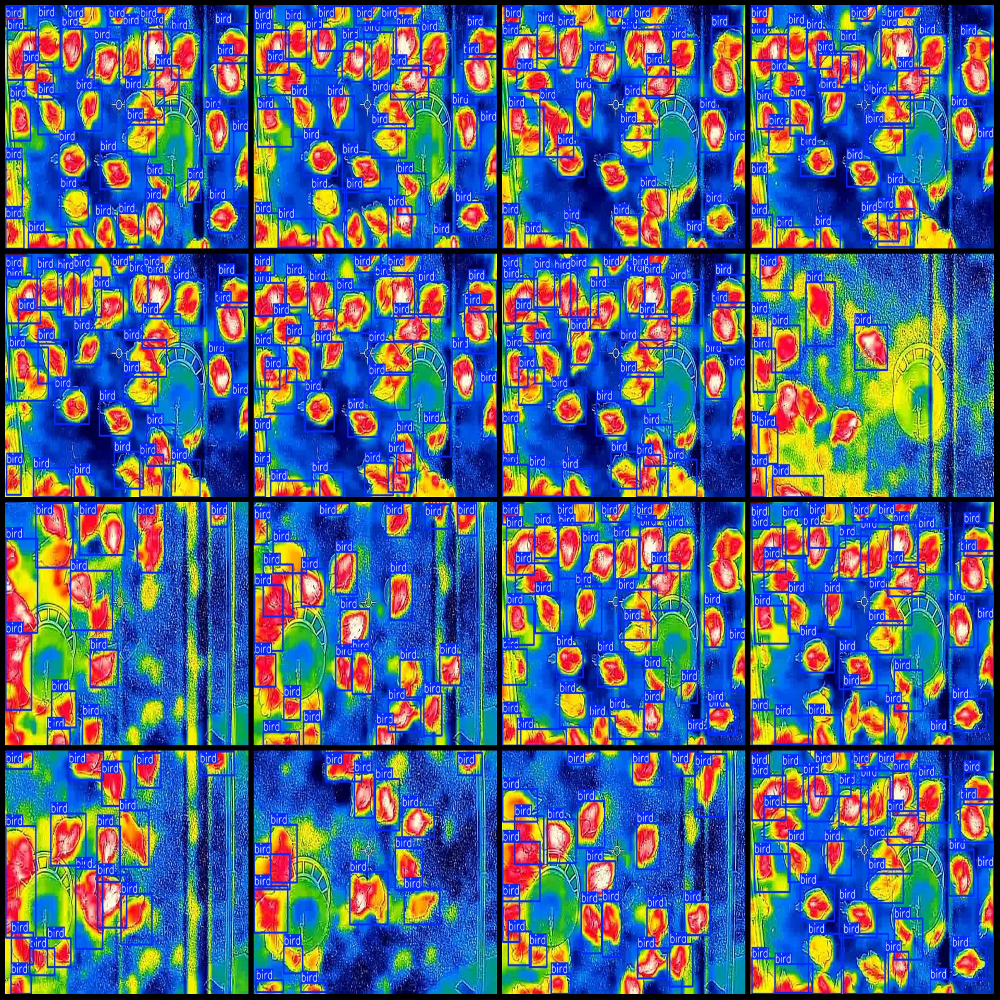
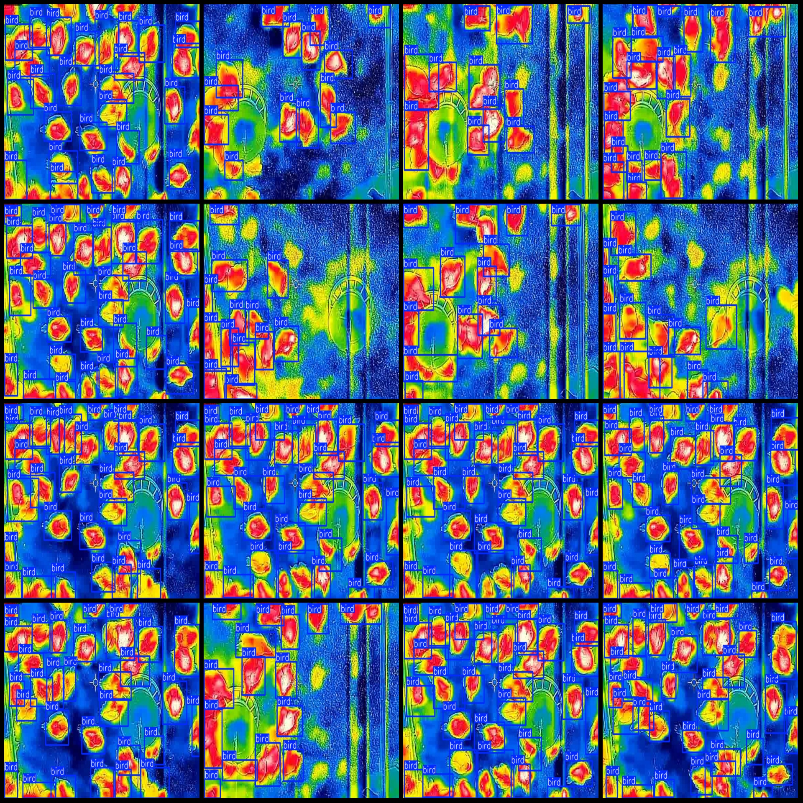

# Infrared Thermal Imaging Image Data Set for Bird and Poultry Detection (VOC+YOLO Format)

## Dataset Format: Pascal VOC Format + YOLO Format (Without the segmentation path in the txt file, only containing jpg images along with corresponding VOC format xml files and yolo format txt files)

### Number of Images (Total): 995

### Number of Annotations (XML Files): 995

### Number of Annotations (TXT Files): 995

### Number of Annotation Categories: 1

**Annotation Category Name:** "bird"

**Number of Boxes per Category:**
- Bird boxes = 23279
- Total boxes = 23279

**Image Resolution:** 568x388

**Annotation Tool Used:** labelImg

**Annotation Rules:** Draw bounding boxes for each category.

**Important Notice:** The dataset does not contain split training/validation/test sets; you will need to manually split them.

**Special Remark:** This dataset does not guarantee the accuracy of trained models or weight files.

---

**Annotation Example:**

## Image

Here is a pay link on Stripe ( https://buy.stripe.com/3cs8yP7sY87d0vu9AB ). Please contact me lonlonago@foxmail.com after funding $89, and I will send you a complete data files , thank you!

